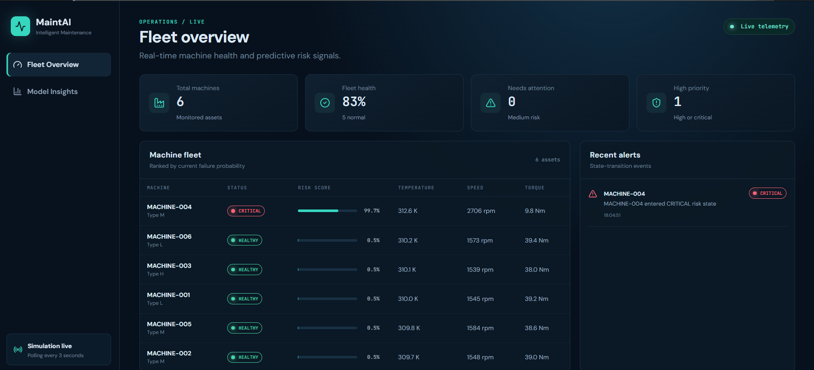
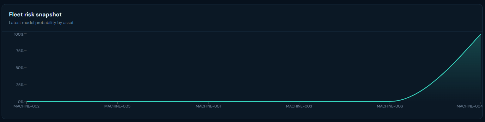
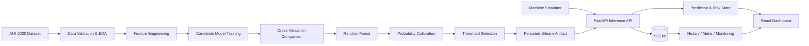
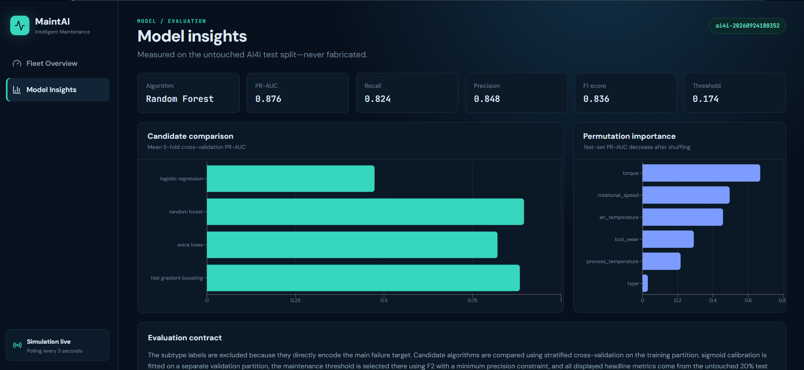
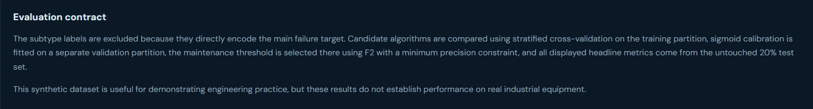

# MaintAI

### Intelligent Predictive Maintenance Platform

MaintAI is an end-to-end machine learning platform that predicts industrial machine failure risk from equipment telemetry, converts model output into actionable maintenance signals, and presents fleet health through a real-time React dashboard.

The project demonstrates the complete ML engineering lifecycle: data analysis, leakage prevention, model comparison, calibration, threshold tuning, inference APIs, persistence, simulation, monitoring, frontend visualization, testing, CI, and containerized deployment.

---

## The Problem MaintAI Addresses

Industrial equipment often follows a reactive maintenance pattern: a machine is repaired after it fails, or serviced on a fixed schedule regardless of its actual condition. Both approaches can be costly.

Unexpected failures can lead to:

- unplanned production downtime
- emergency maintenance costs
- missed production targets
- avoidable equipment damage
- inefficient technician allocation
- unnecessary preventive maintenance on healthy machines

MaintAI addresses this by continuously evaluating machine operating signals such as temperature, rotational speed, torque, tool wear, and machine type, then estimating the likelihood of machine failure before an actual breakdown occurs.

Instead of asking only **“Has the machine failed?”**, MaintAI helps operations teams ask:

> **“Which machines are becoming risky, how risky are they, and which assets should receive attention first?”**

---

## Business Outcome

MaintAI is designed to support condition-based and predictive maintenance decisions.

| Business Need | MaintAI Contribution | Intended Business Outcome |
|---|---|---|
| Reduce unexpected downtime | Identifies machines with elevated failure probability | Earlier maintenance intervention and fewer surprise breakdowns |
| Prioritize maintenance effort | Ranks assets by current model risk | Technicians can focus on the machines that need attention first |
| Improve asset visibility | Centralizes telemetry, machine status, risk history, and alerts | Faster operational awareness across the monitored fleet |
| Reduce unnecessary maintenance | Distinguishes healthy machines from high-risk machines | Maintenance effort can be directed by condition rather than schedule alone |
| Support data-driven decisions | Exposes calibrated probabilities, thresholds, metrics, and feature importance | Maintenance decisions can be supported by measurable evidence |
| Improve traceability | Persists telemetry, predictions, transitions, and alerts | Historical risk changes can be reviewed and audited |

> MaintAI is a portfolio and engineering demonstration built on a synthetic predictive-maintenance dataset. It does not claim validated business savings or real-world industrial performance.

---

## Product Experience

MaintAI behaves like a compact industrial monitoring product rather than a standalone ML notebook.

The dashboard continuously receives simulated equipment telemetry, sends it through the trained ML pipeline, stores predictions and machine history, and updates the UI every few seconds.

### Fleet Overview

The Fleet Overview provides a live operational view of monitored machines, current health, failure probability, telemetry, priority level, and recent state-transition alerts.



### Fleet Risk Snapshot

Machines are ranked by their latest model probability so the highest-risk assets are immediately visible.



---

# How MaintAI Works



The system deliberately separates **model training** from **production inference** while sharing the same preprocessing pipeline to reduce training-serving skew.

---

# Machine Learning Approach

## Dataset

MaintAI uses the **AI4I 2020 Predictive Maintenance Dataset** from the UCI Machine Learning Repository.

The dataset contains approximately 10,000 synthetic industrial operating observations with features including:

- machine/product type
- air temperature
- process temperature
- rotational speed
- torque
- tool wear
- machine failure target
- failure subtype labels

The dataset is synthetic and is used to demonstrate predictive-maintenance ML engineering practices. It is not presented as live telemetry from a real factory.

Official dataset: https://archive.ics.uci.edu/dataset/601/ai4i+2020+predictive+maintenance+dataset

---

## Leakage Prevention

Failure subtype labels are excluded from the main failure-prediction feature set because they directly encode the failure outcome and would create target leakage.

MaintAI does **not** expose failure-mode prediction in the product because the subtype labels are sparse, overlapping, and contain inconsistent records. Rather than forcing an unreliable secondary classifier, the platform focuses on a defensible binary failure-risk model.

---

## Candidate Models

The training pipeline compares multiple classical ML algorithms using stratified cross-validation and PR-AUC as a primary model-selection signal.

Candidate models include:

- Logistic Regression
- Random Forest
- Extra Trees
- Histogram Gradient Boosting

Random Forest was selected after evaluation and is then calibrated before production use.

### Model Comparison and Explainability



Permutation importance is reported as model explainability evidence. In the current trained model, torque, rotational speed, air temperature, tool wear, and process temperature are among the most influential features.

Feature importance is interpreted as **model influence**, not physical causality.

---

# Final Model Performance

The final production artifact is a **calibrated Random Forest** evaluated on an untouched 20% test partition containing 2,000 observations.

| Metric | Result |
|---|---:|
| Model | Calibrated Random Forest |
| Decision threshold | **0.1741** |
| Precision | **0.8485** |
| Recall | **0.8235** |
| F1 score | **0.8358** |
| PR-AUC | **0.8759** |
| ROC-AUC | **0.9713** |
| Brier score | **0.00854** |

### Why the threshold is not 0.50

MaintAI does not assume that `0.50` is the correct maintenance decision threshold.

The decision threshold is selected on a separate validation partition using an F2-oriented objective with a minimum precision constraint. This gives greater weight to detecting real failures while still controlling false maintenance alerts.

The threshold is therefore a product decision derived from validation evidence rather than a default classifier setting.

---

## Evaluation Contract



The evaluation design follows these rules:

- candidate algorithms are compared only on the training partition
- stratified cross-validation is used for candidate comparison
- sigmoid calibration is fitted on a separate validation partition
- maintenance threshold selection happens on validation data
- headline metrics are reported only from the untouched test set
- subtype labels are excluded from model inputs
- displayed product metrics are generated from the real training pipeline and are not hardcoded

---

# Real-Time Risk Workflow

For each telemetry event, MaintAI performs the following flow:

```text
Machine telemetry
      ↓
Input validation
      ↓
Shared preprocessing pipeline
      ↓
Calibrated Random Forest
      ↓
Failure probability
      ↓
Maintenance threshold
      ↓
Risk state
      ↓
History + alert processing
      ↓
React visualization
```

Example telemetry:

```json
{
  "machine_id": "MACHINE-004",
  "type": "M",
  "air_temperature": 302.1,
  "process_temperature": 312.6,
  "rotational_speed": 2706,
  "torque": 9.8,
  "tool_wear": 210
}
```

The application can then produce a calibrated failure probability and translate it into a machine risk state used by the dashboard and alert engine.

During end-to-end validation, the simulator produced a real `CRITICAL` transition with a model probability of `0.9968`; the event was persisted and exactly one transition alert was emitted.

---

# Alert Design

MaintAI uses state-transition-based alerting rather than creating a new alert on every polling cycle.

For example:

```text
HEALTHY → HIGH      => create alert
HIGH → HIGH         => no duplicate alert
HIGH → CRITICAL     => create new alert
CRITICAL → CRITICAL => no duplicate alert
```

This keeps the alert feed meaningful and prevents repeated notifications for the same machine state.

---

# System Architecture

MaintAI is implemented as a monorepo with four major runtime responsibilities.

| Layer | Technology | Responsibility |
|---|---|---|
| ML pipeline | Python, pandas, scikit-learn | Data preparation, feature engineering, model comparison, calibration, evaluation, artifact creation |
| Backend | FastAPI, Pydantic, SQLite | Inference, validation, persistence, history, alerts, monitoring, model metadata |
| Simulator | Python | Generates deterministic machine telemetry and failure scenarios |
| Frontend | React, TypeScript, Vite | Fleet monitoring, machine status, model metrics, charts, alerts |

Additional engineering support includes:

- Docker / Docker Compose
- GitHub Actions CI
- pytest
- Vitest
- Ruff
- production frontend build validation

---

# Repository Structure

```text
MaintAI/
├── ml/
│   ├── data/
│   ├── artifacts/
│   ├── reports/
│   └── src/maintai_ml/
│
├── backend/
│   ├── app/
│   │   ├── api/
│   │   ├── schemas/
│   │   ├── services/
│   │   └── main.py
│   └── tests/
│
├── simulator/
│   └── machine.py
│
├── frontend/
│   └── src/
│
├── docs/
│   └── assets/
│
├── scripts/
├── .github/workflows/
├── docker-compose.yml
└── README.md
```

---

# API Capabilities

The FastAPI service provides production-style model-serving and operational endpoints, including capabilities for:

- health and readiness checks
- machine failure prediction
- current machine fleet state
- individual machine details
- telemetry and risk history
- alerts
- model information
- evaluation metrics
- lightweight monitoring

Interactive OpenAPI documentation is available when the backend is running:

```text
http://localhost:8001/docs
```

---

# Running MaintAI Locally

## Prerequisites

- Python 3.12 recommended
- Node.js LTS
- npm
- Git
- Docker Desktop optional

## 1. Python environment

```powershell
python -m venv .venv
.\.venv\Scripts\Activate.ps1
python -m pip install --upgrade pip
pip install -r requirements.txt
```

## 2. Start the backend

```powershell
uvicorn backend.app.main:app --reload --host 0.0.0.0 --port 8001
```

Backend documentation:

```text
http://localhost:8001/docs
```

## 3. Start the frontend

```powershell
cd frontend
npm install
npm run dev
```

## 4. Start the simulator

From the repository root in another activated Python environment:

```powershell
python -m simulator.machine
```

Ensure the frontend and simulator are configured to use:

```text
http://localhost:8001
```

---

# Docker Deployment

The full application can be launched using Docker Compose:

```bash
docker compose up --build
```

Default containerized endpoints:

```text
Dashboard:  http://localhost:8080
API docs:   http://localhost:8000/docs
Readiness:  http://localhost:8000/ready
```

Stop the stack with:

```bash
docker compose down
```

---

# Validation Status

The completed platform has been validated across ML, backend, frontend, simulator, and container layers.

- **10 Python tests passed**
- **Vitest frontend component test passed**
- **frontend production build passed**
- **Ruff reports no issues**
- **production npm audit reports zero vulnerabilities**
- **backend, persistence, simulator, alerts, and monitoring exercised end to end**
- **Docker images built successfully**
- **backend, frontend, and simulator verified in containers**
- **dashboard successfully displayed six live simulated machines**
- **container inference observed at approximately 40–55 ms per telemetry reading**

A harmless Starlette/httpx deprecation warning may appear in the test harness.

---

# Engineering Decisions

### Shared sklearn pipeline

Preprocessing and model inference are persisted together so production telemetry goes through the same transformation logic used during training.

### SQLite instead of external infrastructure

MaintAI only needs durable local history for the portfolio use case. SQLite provides persistence without adding unnecessary database infrastructure.

### Polling instead of WebSockets

The React dashboard polls every three seconds. For six simulated machines this is simple, reliable, and sufficient. WebSockets would add complexity without meaningful benefit for this scale.

### Calibration before displaying probability

Because the UI displays failure probability, MaintAI calibrates the selected classifier rather than treating raw classification scores as trustworthy probabilities.

### No forced failure-subtype classifier

The available labels do not support a sufficiently defensible failure-mode product feature, so the UI does not fabricate one.

---

# Limitations

MaintAI intentionally documents its limitations:

- the AI4I dataset is synthetic
- current performance does not establish performance on real industrial equipment
- simulated telemetry is designed for system demonstration, not physical equipment emulation
- no real sensor drift or hardware failure process is represented
- risk thresholds would require domain and cost validation before real deployment
- model retraining is offline rather than automated
- the system is designed as a portfolio-scale platform rather than a safety-critical industrial control system

---

# Future Enhancements

Possible future directions include:

- integration with real IoT sensor streams
- time-series window features
- vibration analysis
- remaining useful life prediction
- cost-sensitive threshold optimization using real maintenance economics
- data drift and concept drift monitoring
- automated retraining workflows
- model registry and experiment tracking
- real industrial validation datasets
- role-based operational dashboards

---

# What This Project Demonstrates

MaintAI was built to demonstrate practical ML engineering across the complete lifecycle.

### Machine Learning

- binary classification
- imbalanced learning
- stratified cross-validation
- model comparison
- probability calibration
- threshold optimization
- permutation importance
- held-out evaluation

### ML Engineering

- reusable preprocessing pipeline
- persisted model artifact
- training-serving consistency
- model metadata
- inference monitoring
- deterministic simulation

### Backend Engineering

- FastAPI
- Pydantic validation
- SQLite persistence
- alert state transitions
- REST APIs
- structured logging

### Frontend Engineering

- React
- TypeScript
- Vite
- live polling
- telemetry visualization
- fleet risk ranking
- model insights

### Software Engineering

- monorepo architecture
- automated tests
- CI
- Docker
- clean separation of concerns
- reproducible local development

---

## MaintAI

**From machine telemetry to maintenance priority — using measurable ML evidence rather than reactive guesswork.**
