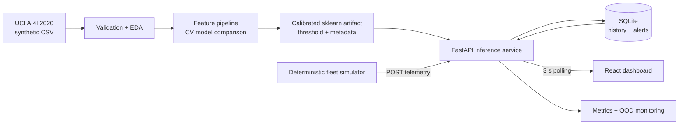

# MaintAI

**Intelligent Predictive Maintenance Platform**

MaintAI is a local-first, end-to-end ML engineering project that predicts machine failure risk from sensor telemetry, explains model influence, simulates evolving operating conditions, stores machine history and alerts, and renders the results in a live React dashboard.

> **Scope:** the AI4I data is synthetic. MaintAI demonstrates sound ML and software-engineering practice; it has not been validated on real equipment and must not be used for safety-critical maintenance decisions.

## What it demonstrates

- Reproducible data validation, EDA, feature engineering, stratified evaluation, calibration, and model selection
- Leakage prevention: `TWF`, `HDF`, `PWF`, `OSF`, and `RNF` are outcome labels and never enter the primary model
- A serialized sklearn inference artifact containing transformations, estimator, calibration, threshold, ranges, and metadata
- Typed FastAPI inference, SQLite history, out-of-distribution warnings, monitoring, and deduplicated alerts
- A deterministic multi-machine telemetry simulator with healthy and gradually degrading scenarios
- A responsive React/TypeScript/Recharts dashboard using live API data
- Python and frontend tests, Docker Compose, structured logs, health checks, and configuration by environment

## Measured results

The committed report is generated by `python -m maintai_ml.train`; the numbers below are from the untouched 20% test split (2,000 rows), not hand-written UI fixtures.

| Metric | Result |
|---|---:|
| Selected model | Random Forest + sigmoid calibration |
| Decision threshold | 0.1741 |
| Precision | 0.8485 |
| Recall | 0.8235 |
| F1 | 0.8358 |
| PR-AUC | 0.8759 |
| ROC-AUC | 0.9713 |
| Brier score | 0.00854 |
| Confusion matrix `[[TN, FP], [FN, TP]]` | `[[1922, 10], [12, 56]]` |

Candidate selection used mean five-fold training PR-AUC: Logistic Regression 0.4733, Extra Trees 0.8205, HistGradientBoosting 0.8838, and Random Forest 0.8953. Accuracy is intentionally not the selection metric because failures comprise only 3.39% of the data.

## Architecture



Training and inference import the same `PhysicalFeatureEngineer`. SQLite is deliberately used instead of infrastructure-heavy storage, and polling is preferred over WebSockets for six low-frequency demo assets. See [architecture decisions](docs/architecture.md).

## Dataset and findings

[AI4I 2020 Predictive Maintenance, UCI ID 601](https://archive.ics.uci.edu/dataset/601/ai4i+2020+predictive+maintenance+dataset) contains 10,000 synthetic observations under CC BY 4.0. The downloaded CSV hash is `dc6630cd9b1f0f853922fad78a1b6436570d3f1ec863f1dd5c4340ac56bc8a8e`.

- 10,000 rows, 14 columns, zero missing values, zero exact duplicate rows
- 339 machine failures (3.39%)
- Product types: 6,000 L, 2,997 M, 1,003 H
- Failure flags: TWF 46, HDF 115, PWF 95, OSF 98, RNF 19
- 27 records where the aggregate target and subtype-flag aggregate differ; subtype labels also overlap and are very sparse

MaintAI therefore does not claim a predicted failure mode. The API returns an empty `predicted_failure_modes` list and model metadata reports that the capability is unsupported. This is more honest than decorating the UI with an unreliable label.

EDA outputs live in `ml/reports/`: summary statistics, a purpose-driven feature/outcome distribution plot, and a correlation plot that explicitly identifies subtype flags as labels.

## ML methodology

The fixed-seed, stratified split is 60% training, 20% validation, and 20% final test. Candidate selection uses five-fold cross-validation inside training only. Random Forest is fitted on training and sigmoid-calibrated on validation. The operational threshold is selected on validation by maximizing F2—weighting missed failures more heavily—while requiring precision of at least 0.25. The final test set is used once for reporting.

Features include the six source predictors plus deterministic temperature difference, approximate mechanical power, wear/torque interaction, and torque/speed ratio. Their inclusion is evaluated as part of the candidate pipelines, not presented as physical causality.

Risk bands are relative to the selected maintenance threshold:

- `HEALTHY`: below 25% of the threshold
- `LOW`: 25–60%
- `MEDIUM`: 60–100%
- `HIGH`: 100–150%
- `CRITICAL`: at or above 150%

Local explanations replace each field with its training median (or modal type) and measure the probability change. They show directional model influence, not root cause. Permutation importance is measured against test PR-AUC.

## Run locally

Requirements: Python 3.11+, Node 20+, and approximately 1 GB free disk space. No secrets, GPU, paid API, or cloud account is needed.

```powershell
python -m venv .venv
.\.venv\Scripts\python.exe -m pip install -e ".[dev]"
.\.venv\Scripts\python.exe scripts\download_data.py
.\.venv\Scripts\python.exe -m maintai_ml.eda
.\.venv\Scripts\python.exe -m maintai_ml.train
cd frontend
npm install
```

Start three terminals from the repository root:

```powershell
# API and Swagger UI: http://localhost:8000/docs
.\.venv\Scripts\uvicorn.exe backend.app.main:app --reload

# Telemetry producer
.\.venv\Scripts\python.exe -m simulator.main --interval 2

# UI: http://localhost:5173
cd frontend
npm run dev
```

The simulator's `--iterations` option supports finite smoke runs. Configuration keys are documented in `.env.example`.

## Docker

```bash
docker compose up --build
```

Open the dashboard at <http://localhost:8080> and API documentation at <http://localhost:8000/docs>. The backend image downloads and trains against the official dataset during the build; runtime history persists in a named SQLite volume.

## API example

```bash
curl -X POST http://localhost:8000/api/v1/predict \
  -H "Content-Type: application/json" \
  -d '{
    "machine_id": "MACHINE-104",
    "type": "M",
    "air_temperature": 301.2,
    "process_temperature": 312.7,
    "rotational_speed": 1275,
    "torque": 67.8,
    "tool_wear": 205
  }'
```

Primary routes: `/health`, `/ready`, `/api/v1/predict`, `/api/v1/machines`, `/api/v1/machines/{id}/history`, `/api/v1/alerts`, `/api/v1/model/info`, `/api/v1/model/metrics`, and `/api/v1/monitoring`.

Schema validation rejects impossible physical values. Values that are valid but outside observed training ranges are accepted with an explicit reliability warning.

## Testing and quality checks

```powershell
.\.venv\Scripts\pytest.exe
.\.venv\Scripts\ruff.exe check backend ml/src ml/tests simulator scripts
cd frontend
npm run build
npm test
```

The tests cover feature calculations, pipeline inference, threshold bands, health/readiness, prediction validation, persistence/history, real artifact metadata, deterministic simulation, degrading scenarios, and a key status component.

## Repository map

```text
backend/                 FastAPI routes, schemas, services, SQLAlchemy models, tests
frontend/                React/Vite dashboard, machine details, model insights
ml/src/maintai_ml/       Shared data, features, training, artifact, and risk logic
ml/data/raw/             Download target (CSV intentionally gitignored)
ml/artifacts/            Generated model artifact (gitignored)
ml/reports/              Generated, reviewable EDA and measured model reports
simulator/               Seeded multi-machine trajectories and API producer
scripts/                 Official dataset acquisition
docs/                    Architecture decisions and evaluation caveats
docker-compose.yml       API, simulator, UI, and persistent local volume
```

## Screenshots

Add repository screenshots here after launching the simulator:

1. Fleet overview with mixed risk states
2. Machine detail with risk and telemetry history
3. Model insights with comparison and importance plots

## Limitations and next steps

- AI4I is synthetic, row-level, and not a real longitudinal fleet dataset. Stratification cannot substitute for temporal or equipment-held-out validation.
- Calibration and threshold selection share the validation partition; a larger project should use nested CV or a dedicated calibration set.
- Input-range checks are simple min/max flags, not multivariate drift detection.
- Perturbation explanations are intuitive but correlated inputs can make them unstable.
- SQLite and polling suit a local portfolio system, not a large fleet.
- A real pilot would require sensor semantics, equipment-specific costs, temporal backtesting, prospective validation, authentication, migrations, and monitored retraining.

Future work: asset-aware temporal datasets, conformal uncertainty, subgroup calibration, Evidently-style drift reports, alert acknowledgement workflows, and CI-built versioned artifacts.

## License

Project code is MIT licensed. The AI4I dataset is distributed separately by UCI under CC BY 4.0 and retains its own attribution and license.

